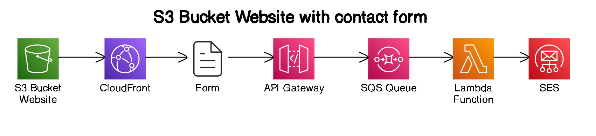
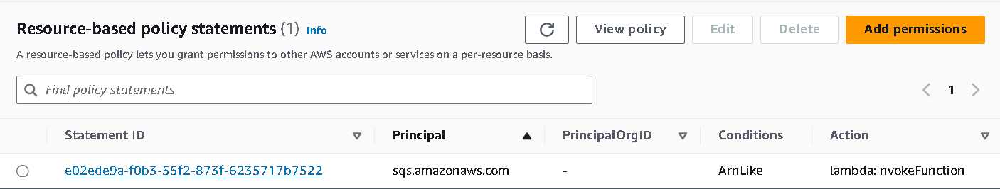
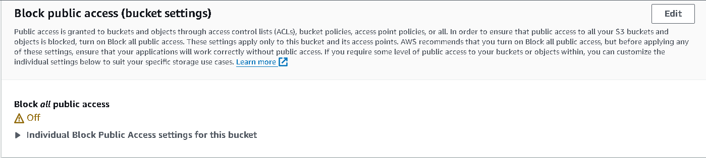
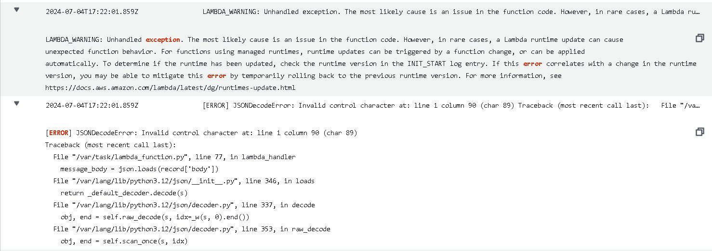

## Intro
In this project we create simple resume website hosted in S3 bucket. In order to provide secure access to S3 bucket, we need to use Cloudfront CDN network, which is as default encrypted. Then to limit access to this website we use Cloudfront Functions to provide Basic auth mechanism.  

- CloudFront for HTTPS
- S3 bucket as hosting for website
- AWS ACM to get free SSL cert (only for AWS resources)
- Route53 to provide custom domain name instead of d111111abcdef8.cloudfront.net we can use our own domain e.g. this-project.example.com
- Cloudfront function to provide Basic Auth
- `cloudfront-function-basic-auth.js` is a javascript code to provide Basic Auth (based on example from https://www.joshualyman.com/)
- Aws api gateway integrated with SQS to receive content of filled out form, them Lambda function + SES service to send to my mailbox


## Challanges:
- #### How to host simple websites?  
\- We can use S3 Bucket as our hosting. We can enable S3 website feature, which provides us with http url to this resource. But this is only http, we cannot add SSL.
- #### How to secure (SSL) S3 bucket website?  
\- We can use Cloudfront service, which not only gives us CDN, but also secured endpoint and built-in DDOS protection - AWS Shield Standard.
- #### Cloudfront availability
\- Aws Cloudfront is great, but if we want to attach our custom domain name e.g. example.com, then we must provide SSL certificate in specific region only (us-east-1)  
- #### Hosted zone must be in the same account
\- We cannot have Route53 hosted zone with our domain in AWS Account A, and create Cloudfront distrobution in AWS Account B. I tried cross-account IAM role permission, but it doesn't work. Cloudfront distro just won't show up in Route53 when creating Record A alias.
- #### How to restrics access to this website in S3 bucket? 
\- We can create simple Basic Auth mechanism in our website using Cloudfront functions. It work like Lambda functions. We can only use Javascsript language to it.  
- #### How to implement Basic auth in website?
\- add `www-authenticate` header to requested website by using Cloudfront functions. DB with identities is hard-coded in Cloudfront function.
- #### DDos protection
\- we can use AWS Shield protection - standard is free and already built-in. A great option is use Cloudflare CDN before AWS Cloudfront, when we want to very cheap deployment.
- #### Logging
\- we can use another S3 bucket to gather logs. Logging option is in Cloudfront service.
- #### How to use some of backend features in static website?
\- we can use api gateway and lambda functions or just lambda functions with external url to invoke function
- #### How to send contenct of the form on the website to my address email?
\- we can use aws ses service. We need to also use api gateway, sqs and lambda. Sqs is optional, but it provides reliability, data from form will be not lost if lambda function crashes.



## Get started
### Create Lambda function + Api Gateway and SES to sends email from contact form on the website.  
#### Init variables.  
```bash
export FunctionName=lambda-to-send-sqs-message-to-ses
export AWS_ACCOUNT_ID=743241827577
export API_GW_RESOURCE_NAME=contact
export API_GW_NAME=api-gateway-name
export QUEUE_NAME=queue-for-ses-service
export SES_EMAIL_SEND_FROM=ra.zmyslony@gmail.com
export ApiGW_SQS_INVOKE_ROLE=ApiGatewaySQSInvokeRole
export STAGE_NAME=production
```

#### Lambda function  

1. Create IAM policy to allow Lambda sending emails from SES with specific email and receive SQS messages.  

```bash
cat > aws-policies/ses-send-email-iam-policy.json <<EOF
{
    "Version": "2012-10-17",
    "Statement": [
        {
            "Effect": "Allow",
            "Action": [
                "ses:SendEmail",
                "ses:SendRawEmail"
            ],
            "Resource": "arn:aws:ses:eu-central-1:$AWS_ACCOUNT_ID:identity/$SES_EMAIL_SEND_FROM"
        }
    ]
}
EOF
aws iam create-policy --policy-name SESSendEmailPolicy --policy-document file://aws-policies/ses-send-email-iam-policy.json
```

```bash
cat > aws-policies/allow-read-messages-from-sqs-iam-policy.json <<EOF
{
	"Version": "2012-10-17",
	"Statement": [
		{
			"Sid": "VisualEditor0",
			"Effect": "Allow",
			"Action": [
				"sqs:*"
			],
			"Resource": "arn:aws:sqs:*:$AWS_ACCOUNT_ID:$QUEUE_NAME"
		}
	]
}
EOF
aws iam create-policy --policy-name ReadSqsMessagesPolicy --policy-document file://aws-policies/allow-read-messages-from-sqs-iam-policy.json
```

2. Create IAM role for lambda function and attach IAM Policies.  
```bash
# This part: --assume-role-policy-document  is to create Trust Policy
aws iam create-role --role-name $FunctionName-role --assume-role-policy-document '{
    "Version": "2012-10-17",
    "Statement": [
        {
            "Effect": "Allow",
            "Principal": {
                "Service": "lambda.amazonaws.com"
            },
            "Action": "sts:AssumeRole"
        }
    ]
}'

aws iam attach-role-policy --role-name $FunctionName-role --policy-arn arn:aws:iam::$AWS_ACCOUNT_ID:policy/SESSendEmailPolicy
aws iam attach-role-policy --role-name $FunctionName-role --policy-arn arn:aws:iam::$AWS_ACCOUNT_ID:policy/ReadSqsMessagesPolicy
```

3. Zip lambda function code:

```bash
zip function.zip lambda_function.py
```
(Optional) Only, if you want application without SQS queue.
Change lamba_function.py code to handle direct integration between api gw and lambda.
```bash
cp lambda_function_without_sqs.py lambda_function.py
```
4. Create Lambda function.  

```bash
aws lambda create-function --function-name $FunctionName --runtime python3.12 --role arn:aws:iam::$AWS_ACCOUNT_ID:role/$FunctionName-role  --handler lambda_function.lambda_handler --zip-file fileb://function.zip --architectures x86_64
```

5. Give Cloudwatch permissions to Lambda. 
```bash
aws iam put-role-policy --role-name $FunctionName-role --policy-name LambdaLoggingPolicy --policy-document file://aws-policies/lambda-logging-policy.json
```

#### SQS
1. Create SQS queue.  
```bash
aws sqs create-queue --queue-name $QUEUE_NAME
QUEUE_URL=$(aws sqs get-queue-url --queue-name $QUEUE_NAME --query 'QueueUrl' --output text)
QUEUE_ARN=$(aws sqs get-queue-attributes --queue-url $QUEUE_URL --attribute-names QueueArn --query 'Attributes.QueueArn' --output text)
```

2. Create IAM Role that will be assumed by Api Gateway to be allowed to send messages to specific SQS queue.  
```bash
aws iam create-role --role-name $ApiGW_SQS_INVOKE_ROLE --assume-role-policy-document file://aws-policies/trust-policy-for-api-gateway.json

cat > aws-policies/allow-api-gw-to-send-message-to-sqs-iam-policy.json << EOF
{
    "Version": "2012-10-17",
    "Statement": [
        {
            "Effect": "Allow",
            "Action": [
                "sqs:SendMessage"
            ],
            "Resource": "arn:aws:sqs:eu-central-1:$AWS_ACCOUNT_ID:$QUEUE_NAME"
        }
    ]
}
EOF

aws iam put-role-policy --role-name $ApiGW_SQS_INVOKE_ROLE --policy-name SQSSendMessagePolicy --policy-document file://aws-policies/allow-api-gw-to-send-message-to-sqs-iam-policy.json

export SQS_IAM_ROLE_FOR_AG=$(aws iam get-role --role-name $ApiGW_SQS_INVOKE_ROLE | jq .Role.Arn | sed 's/"//g')
```

#### Api Gateway
a) Api Gw + SQS + Lambda + SES
1. Create HTTP Api Api Gateway.  
```bash
aws apigatewayv2 create-api \
    --name $API_GW_NAME \
    --protocol-type "HTTP"

export API_ID=$(aws apigatewayv2 get-apis --query "Items[?Name=='$API_GW_NAME'].ApiId" --output text)
```

2. Create route for receiving POST requests.  
```bash
aws apigatewayv2 create-route \
    --api-id $API_ID \
    --route-key "POST /$API_GW_RESOURCE_NAME"

export ROUTE_ID=$(aws apigatewayv2 get-routes --api-id $API_ID | jq .Items[].RouteId | sed 's/"//g')

```

3. Create integration between api gateway resource and SQS queue.  
```bash
export LAMBDA_ARN=$(aws lambda get-function --function-name $FunctionName | jq .Configuration.FunctionArn | sed 's/"//g')
aws apigatewayv2 create-integration \
    --api-id $API_ID \
    --integration-subtype SQS-SendMessage \
    --integration-type AWS_PROXY \
    --credentials-arn arn:aws:iam::$AWS_ACCOUNT_ID:role/$ApiGW_SQS_INVOKE_ROLE \
    --request-parameters '{"QueueUrl":"'$QUEUE_URL'","MessageBody":"$request.body"}' \
    --payload-format-version 1.0


export INTEGRATION_ID=$(aws apigatewayv2 get-integrations --api-id $API_ID | jq .Items[].IntegrationId | sed 's/"//g')
```

4. Integrate a given api gateway resource with integration.  
```bash
aws apigatewayv2 update-route --api-id $API_ID --route-id $ROUTE_ID --target integrations/$INTEGRATION_ID
```

5. Create stage. 
```bash
aws apigatewayv2 create-stage --api-id $API_ID --stage-name $STAGE_NAME
```

6. Create deployment.  
```bash
aws apigatewayv2 create-deployment \
    --api-id $API_ID \
    --stage-name "$STAGE_NAME"
```

7. Give Lambda resource-based policy to allow
```bash
aws lambda add-permission \
 --statement-id e02ede9a-f0b3-55f2-873f-6235717b7522 \
 --action lambda:InvokeFunction \
 --function-name arn:aws:lambda:eu-central-1:$AWS_ACCOUNT_ID:function:$FunctionName \
 --principal sqs.amazonaws.com \
 --source-arn "arn:aws:execute-api:eu-central-1:$AWS_ACCOUNT_ID:$QUEUE_NAME"
```
It will create Resource-based policy statement in Lambda function:


8. Integrate lambda function with SQS (we want Lambda to process SQS queue). 
```bash
aws lambda create-event-source-mapping \
    --function-name $FunctionName \
    --batch-size 1 \
    --event-source-arn $QUEUE_ARN \
    --enabled
```

8. Test. Send a sample request.  
```bash
export API_GW_FULL_ENDPOINT=$(aws apigatewayv2 get-api --api-id $API_ID | jq .ApiEndpoint | sed 's/"//g')/$STAGE_NAME/$API_GW_RESOURCE_NAME

curl -X POST -d '{"name": "1856", "email": "'"$(date +%r)"'", "subject": "Jabroni test", "message": "'"$(date +%H:%M)"'"}' $API_GW_FULL_ENDPOINT
```


b) (Optional) if you don't want to use SQS, only Api Gw + Lambda + SES

1. Create HTTP Api Api Gateway.  
```bash
aws apigatewayv2 create-api \
    --name $API_GW_NAME \
    --protocol-type "HTTP"

export API_ID=$(aws apigatewayv2 get-apis --query "Items[?Name=='$API_GW_NAME'].ApiId" --output text)
```

2. Create route for receiving POST requests.  
```bash
aws apigatewayv2 create-route \
    --api-id $API_ID \
    --route-key "POST /$API_GW_RESOURCE_NAME"

export ROUTE_ID=$(aws apigatewayv2 get-routes --api-id $API_ID | jq .Items[].RouteId | sed 's/"//g')

```

3. Create integration between api gateway resource and Lambda.  
```bash
export LAMBDA_ARN=$(aws lambda get-function --function-name $FunctionName | jq .Configuration.FunctionArn | sed 's/"//g')
aws apigatewayv2 create-integration \
    --api-id $API_ID \
    --integration-type AWS_PROXY \
    --integration-uri $LAMBDA_ARN \
    --payload-format-version 2.0

export INTEGRATION_ID=$(aws apigatewayv2 get-integrations --api-id $API_ID | jq .Items[].IntegrationId | sed 's/"//g')
```

4. Integrate a given api gateway resource with integration.  
```bash
aws apigatewayv2 update-route --api-id yww9i16im8 --route-id $ROUTE_ID --target integrations/$INTEGRATION_ID
```

5. Create deployment.  
```bash
aws apigatewayv2 create-deployment --api-id $API_ID --stage-name $STAGE_NAME
```

6. Add resource policy to Lambda function, to allow Api Gateway access this Lambda function.
```bash
aws lambda add-permission \
 --statement-id e02ede9a-f0b3-55f2-873f-6235717b7522 \
 --action lambda:InvokeFunction \
 --function-name arn:aws:lambda:eu-central-1:$AWS_ACCOUNT_ID:function:$FunctionName \
 --principal apigateway.amazonaws.com \
 --source-arn "arn:aws:execute-api:eu-central-1:$AWS_ACCOUNT_ID:$API_ID /*/*/$API_GW_RESOURCE_NAME"
```

7. Test. Send a sample request.  
```bash
export API_GW_FULL_ENDPOINT=$(aws apigatewayv2 get-api --api-id $API_ID | jq .ApiEndpoint | sed 's/"//g')/$STAGE_NAME/$API_GW_RESOURCE_NAME
curl -X POST -d '{"name": "1856", "email": "'"$(date +%r)"'", "subject": "Jabroni test", "message": "'"$(date +%H:%M)"'"}' $API_GW_FULL_ENDPOINT
```


### Hosting website on S3 bucket
#### S3 bucket
```shell
export HOSTED_ZONE_ID="/hostedzone/Z0444904IRSUOB0SGBLV"  
export BUCKET_NAME=my-cv-website-from-cli-29052024
```
1. Create/make bucket:  
```shell
aws s3 mb s3://$BUCKET_NAME
```

Generate bucket policy with customizing $BUCKET_NAME:
```bash
cat > aws-policies/iam-policy-to-allow-s3-public-access.json << EOF
{
    "Version": "2012-10-17",
    "Statement": [
        {
            "Effect": "Allow",
            "Principal": "*",
            "Action": "s3:GetObject",
            "Resource": "arn:aws:s3:::$BUCKET_NAME/*"
        }
    ]
}
EOF
```
Delete `Block all public access` option:  
```bash
aws s3api delete-public-access-block --bucket $BUCKET_NAME
```  
So it should looks like this:  
  
Then add bucket policy to allow public access this bucket that will host website:  
```bash
aws s3api put-bucket-policy --bucket $BUCKET_NAME  --policy file://aws-policies/iam-policy-to-allow-s3-public-access.json
```
2. Put POST api gateway resource into form section in the your website. (This endpoint will be requested to POST data from the filled out form).
```bash
export API_GW_FULL_ENDPOINT=$(aws apigatewayv2 get-api --api-id $API_ID | jq .ApiEndpoint | sed 's/"//g')/$STAGE_NAME/$API_GW_RESOURCE_NAME
# API_GW_FULL_ENDPOINT should looks like this:
# https://qed7acymqe.execute-api.eu-central-1.amazonaws.com/production/contact
```
In my website, endpoint is in `apiGwEndpoint` variable.  
For example: line of code should be empty inside `let apiGwEndpoint = ''`
```bash
sed -i "s|let apiGwEndpoint = ''|let apiGwEndpoint = '$API_GW_FULL_ENDPOINT'|" my-website/index.html
```

3. Upload your website files. 
```bash
# my-website is name of directory containg my websie
aws s3 cp my-website s3://$BUCKET_NAME/ --recursive
```

3. Enable static website hosting.  
```bash
aws s3 website s3://$BUCKET_NAME/ --index-document index.html
```

4. Paste name of S3 bucket into `cloudfront-config.json` - `Origins` and `TargetOriginId` sections.  
```bash
cat cloudfront-config.json | jq .Origins.Items[].Id='"'$BUCKET_NAME'"' > tmp.config.json && mv tmp.config.json cloudfront-config.json
cat cloudfront-config.json | jq .Origins.Items[].DomainName='"'$BUCKET_NAME'.s3.eu-central-1.amazonaws.com"' > tmp.config.json && mv tmp.config.json cloudfront-config.json
cat cloudfront-config.json | jq .DefaultCacheBehavior.TargetOriginId='"'$BUCKET_NAME'"' > tmp.config.json && mv tmp.config.json cloudfront-config.json
```
5. Create SSL Certificate for website.  
```bash
aws acm request-certificate --domain-name resume.zmyslony.ovh --validation-method DNS --region us-east-1
```

6. Copy output (arn) to cloudront-config.json in `ACMCertificateArn` section.  
```bash
export ACM_CERT_ARN=$(aws acm list-certificates --region us-east-1 | jq .CertificateSummaryList[].CertificateArn | sed 's/"//g')
cat cloudfront-config.json | jq .ViewerCertificate.ACMCertificateArn='"'$ACM_CERT_ARN'"' > tmp.config.json && mv tmp.config.json cloudfront-config.json
```

7. Make ssl dns validation (you can also choose email verification), otherwise status is pending. 
Copy and paste CNAME records to this file `create-route53-record.json`:  
```bash
export ACM_CNAME=$(aws acm describe-certificate --certificate-arn $ACM_CERT_ARN --region us-east-1 | jq .Certificate.DomainValidationOptions[].ResourceRecord.Name | sed 's/"//g')
export ACM_CNAME_VALUE=$(aws acm describe-certificate --certificate-arn $ACM_CERT_ARN --region us-east-1 | jq .Certificate.DomainValidationOptions[].ResourceRecord.Value | sed 's/"//g')

cat create-route53-record.json | jq .Changes[].ResourceRecordSet.ResourceRecords[].Value='"'$ACM_CNAME_VALUE'"'> tmp.config.json && mv tmp.config.json create-route53-record.json        
cat create-route53-record.json | jq .Changes[].ResourceRecordSet.Name='"'$ACM_CNAME'"'> tmp.config.json && mv tmp.config.json create-route53-record.json        

aws route53 change-resource-record-sets --hosted-zone-id $HOSTED_ZONE_ID --change-batch file://create-route53-record.json 
```


8. Create cloudfront distrobution. 
Customize remaining fields e.g. `cloudfront-config.json` `Aliases` section  
```zsh
aws cloudfront create-distribution --distribution-config file://cloudfront-config.json --region us-east-1
```

9. Create A record to point `resume.zmyslony.ovh` to cloudfront distro.
Then you can see new created record.  
```bash
export CLOUDFRONT_DOMAIN_NAME=$(aws cloudfront list-distributions --region us-east-1 | jq .DistributionList.Items[].DomainName | sed 's/"//g')
cat update-route53-record.json | jq .Changes[].ResourceRecordSet.AliasTarget.DNSName='"'$CLOUDFRONT_DOMAIN_NAME'"'> tmp.config.json && mv tmp.config.json update-route53-record.json

aws route53 change-resource-record-sets --hosted-zone-id $HOSTED_ZONE_ID --change-batch file://update-route53-record.json
```
! `Z2FDTNDATAQYW2` is a static value for Aws Cloudfront in Route53 service. Not change it for your cloudfront id or for hosted zone id.  
You can check if everything is correct:
```bash
aws route53 list-resource-record-sets --hosted-zone-id  $HOSTED_ZONE_ID | jq .ResourceRecordSets
```
where output can look like this:
```
  {
    "Name": "resume.zmyslony.ovh.",
    "Type": "A",
    "AliasTarget": {
      "HostedZoneId": "Z2FDTNDATAQYW2",
      "DNSName": "d3s3xv9posocgm.cloudfront.net.",
      "EvaluateTargetHealth": false
    }
```
10. Add CORS rule for Api Gateway, to accept only my website. 
```bash
export MY_WEBSITE_URL=https://resume.zmyslony.ovh
export API_ID=$(aws apigatewayv2 get-apis --query "Items[?Name=='$API_GW_NAME'].ApiId" --output text)
aws apigatewayv2 update-api \
  --api-id $API_ID \
  --cors-configuration AllowOrigins="$MY_WEBSITE_URL",AllowMethods=POST,AllowHeaders=Content-Type
```
Deploy all changes again to api gateway.  
```bash
aws apigatewayv2 create-deployment --api-id $API_ID --stage-name $STAGE_NAME
```
### Clean-up - those commands are available in quickstart.md file
In quickstart.md file there are command how to clean-up quickly using `aws cli`.  
1. Disable cloudfront distrobution, then you can delete it.
2. Delete S3 bucket.
3. Remove SSL cert from AWS ACM service.  
4. Remove Lambda function.
5. Remove Api Gateway.  
6. Remove SQS queue.

## Tips:
- use `us-east-1` region for SSL cert in aws ACM, because only there us available to use domain alias for Cloudfront distrobution (resume.example.com)


- your Route53 hosted zone must be in the same aws account as created cloudfront distro - cross-account IAM permissions don't help
- Don't use `legacy client support` - rarely used and very expensive!  


- use `lambda_function.py` for lambda function file, because as default a lambda.handler is  a `lambda_function` in `aws lambda create-function`
```bash
aws lambda create-function --function-name $FunctionName --runtime python3.12 --role arn:aws:iam::$AWS_ACCOUNT_ID:role/$FunctionName-role --handler lambda_function.lambda_handler --zip-file fileb://function.zip --architectures x86_64
```  
- Lambda with SQS integration work like this - it polls 21600 times a day (21600 times Lambda issue API request to poll this queue). This is default (defined by AWS) settings. It poll in parallel 5 times every 20s.
```
# https://stackoverflow.com/questions/52904643/aws-lambda-triggered-by-sqs-increases-sqs-request-count
five requests to SQS every 20 seconds for AWS Lambda functions without significant load, which sums up to the ~21600 per day, which is close to the 20000 you're experiencing.
```

- Sometimes a lambda can run all over with the same messages from SQS. It can be caused by a failed code in lambda, e.g. not `try` statement. I had a such case, because one of messages did not have some quotes, and I put `json.load(message)` code which cause errors. So each time when I put another POST request to `/contact` endpoint, Lambda tried to process this broken message first. Errors in CloudWatch can looks like this:

Solution could be also a `Dead-letter Queue (DLQ)` feature, because DLQ could capture broken messages. In my project it is turned off. DLQ is another SQS queue which receive messages, if for example for the fifth time it cannot be succesfully processed by consumer (e.g. Lambda funtion).
Another solution is to fix our lambda code (e.g. we can add try statement) and purge queue. Then send another message by POST request to our api gateway endpoint. Watch out! By purging messages you lost data. The best option still persists DLQ.
```
aws sqs purge-queue --queue-url $QUEUE_URL
```

- This setup is asynchronous - Api Gateway receives
synchronous is more expensive - more time it takes to process

- CORS is even necessary if we use Api Gateway. For example, we can get a such error in our browser:  
```
/#contact:1 Access to fetch at 'https://saju3ypaz3.execute-api.eu-central-1.amazonaws.com/production/contact' from origin 'http://my-cv-website-04072024.s3-website.eu-central-1.amazonaws.com' has been blocked by CORS policy: No 'Access-Control-Allow-Origin' header is present on the requested resource. If an opaque response serves your needs, set the request's mode to 'no-cors' to fetch the resource with CORS disabled.
```

aws apigatewayv2 update-api \
    --api-id $API_ID \
    --cors-configuration AllowOrigins="*",AllowMethods=POST,AllowHeaders="Content-Type"


## Bonus  
- `flask-return-401.py` is a simple app to show how Basic Auth work, by just handling http header (www-authenticate)

## Helpful websites
- https://www.joshualyman.com/2022/01/add-http-basic-authentication-to-cloudfront-distributions/
- https://www.linkedin.com/pulse/6-ways-cloudfront-functions-authentication-accounting-sch%C3%A4ffler/
